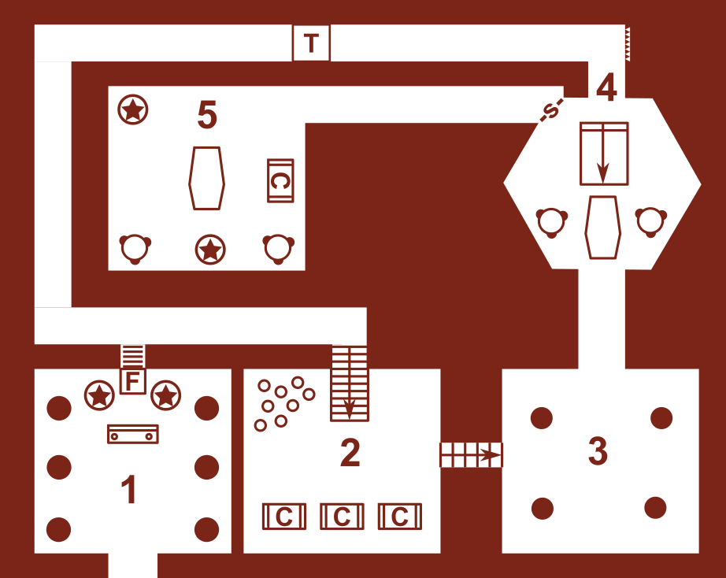

= Der Waldschrein
Autor Thomas Junk
:toc: left

.OSR logo by Stuart Robertson

== Synopsis

NOTE: Es handelt sich bei diesem Abenteuer um ein Einstiegsabenteuer.
Die Idee dabei war es, den klassischen 5-Room-Dungeon dazu zu nutzen, 
die Spieler mit einem kleinen Abenteuer zu unterhalten und in die 
Welt der Verliese und Monster einzuführen. 
 

- Die Abenteurer müssen die Eingangsherausforderung meistern, die ihnen erst
den Eintritt zum Dungeon verschafft.
- Raum 2 bietet Interaktionsmöglichkeiten mit der dinglichen Umwelt, 
wo sie Fässer und Truhen untersuchen können
- In Raum 3 gibt es Kontakt mit Gegenspielern der Welt
- Klimax ist in Raum 4, wo die Abenteurer, wenn sie unvorsichtig sind, wieder nach Raum 3 
hinabrutschen.
- Eine Belohnung gibt es in Raum 5, wo ein Grabmal samt Beigaben wartet.

== Auftakt

Am Rande eines Waldes befinden sich die Überreste eines uralten Schreines.
Das Dach scheint in Teilen eingestürzt, die Mauern von Moos überwachsen.
Ein plötzlich einsetzender Regenschauer lässt die Spieler Zuflucht in der 
Ruine suchen.

== Der Waldschrein
.Karte

=== Raum 1

Der Sakralraum ist heruntergekommen.
Teile des Deckengewölbes liegen auf dem Fußboden des Altarraums.
Wildtiere hausen im Gemäuer. *W4* Wölfe haben Zuflucht in der Ruine gesucht.

TIP: Wenn die Spieler die hinter dem Altar liegenden Trümmer wegräumen,
gewahren sie eine steinerne Falltür. Wenn sie den Altar untersuchen, finden sie den
Mechanismus, die Falltür zu öffnen.

Wenn die Spieler die Falltür gefunden haben, können sie sich hinablassen.
Im Schacht befindet sich eine Leiter, mit der sie in das Gewölbe unter dem Schrein hinabsteigen können.

=== Raum 2

Dieser Raum beherbergt nichts weiter außer ein paar Fässern und drei alten Kisten.
Die Fässer sind größtenteils leer und manche zerstört. In den noch vollen Fässern befindet sich ungenießbarer Wein.
In einer der Truhen befinden sich ein zerrissenes Gewand und ein unglücksverheißender Ring.
Der Spieler ahnt, dass der Ring magisch sein könnte, wenn er ihn aufsetzt.

=== Raum 3

Noch bevor sie den Raum betreten, hören die Spieler Wasser plätschern.
Der Grund ist das Regenwasser, das als Sickerwasser die Wände entlang rinnt.
Die Gewölbedecke ist im hinteren Teil eingebrochen. Dort tropft der Regen durch.
Der Fußboden ist etwas mehr als handbreit mit Wasser befüllt.

Die Spieler treffen hier auf ihre nächste Herausforderung: 
Ein Tatzelwurm ist durch die Decke gestürzt und seit dem hier unten gefangen.

=== Raum 4

IMPORTANT: Bevor die Spieler Raum 4 betreten, erleben sie eine unsanfte Überraschung. Durch einen 
magischen Mechanismus wird ein Alarmsystem aktiviert, bei dem (Gift-) Pfeile aus der Wand schießen.

In Raum 4 kommen die Spieler in eine Grabkammer. Kurz bevor sie den Raum vollends betreten, kommt ihnen
ein Priester-Skelett entgegen. Ist diese Herausforderung gemeistert, können die Spieler beginnen, die Kammer zu untersuchen.
Sollten die Spieler zu unvorsichtig sein, rutschen sie eine Falltreppe entlang nach Raum 3.

NOTE: Nur durch eine Geheimtür kann man nach Raum 5 gelangen.

=== Raum 5

Sind die Spieler in Raum 5 angelangt, befinden sie sich in der eigentlichen Grabkammer.
In der Truhe befinden sich die Hinterlassenschaften eines Kultisten.
Neben einem purpurnen Umhang, ein paar Schriftrollen befinden sich in der Truhe
eine vergoldete Hirschmaske, ein Bernsteinamulett und zwei Blutsteine.

WARNING: Sollten es die Spieler wagen, den Sarkophag zu öffnen und die Ruhe des toten Priesters zu
stören, sehen sie sich einem erzürnten Poltergeist gegenüber.

== Gegenspieler

,===
Anzahl, Name, Aufenthaltsort, Besonderheit

1, Poltergeist, (5), Beherrscht Telekinese
1, Skelett, (4), -
1, Tatzelwurm, (3), Der Atem des Tatzelwurms entält giftige Dämpfe
W4, Wölfe, (1), -
,===

== Beute

.Gegenstände
,=== 
Name, Wert, (magische) Besonderheit
Vergoldete Hirschmaske, 200GM, verbessert Wahrnehmung
Purpurumhang, 1GM, sakral bestickt - ohne besondere Bedeutung 
Schriftrollen, ?, die Schrift ist den Spielern unbekannt 
Ring, 20GM, Verflucht
,===

.Schätze
,===
Anzahl, Name, Wert
1, Bersteinamulett, 150GM
2, Blutsteine 
,===
